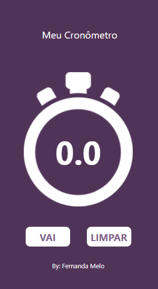
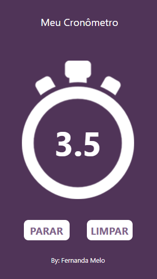
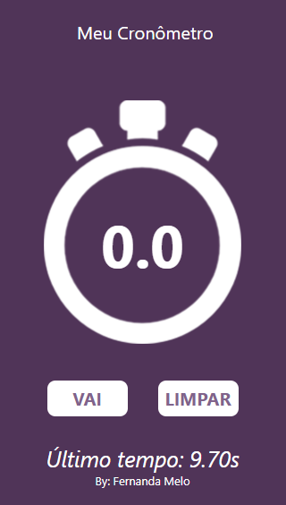

# App Cronômetro - React Native

Um **aplicativo de cronômetro** desenvolvido em **React Native** como exercício prático para treinar **estados, eventos e componentes de classe**.

O app permite **iniciar, parar e reiniciar** a contagem de tempo, exibindo também o **último tempo registrado**.

---

## Funcionalidades

- **Iniciar / Parar**: Comece ou pause a contagem a qualquer momento.  
- **Limpar**: Reinicia o cronômetro e armazena o último tempo registrado.  
- **Exibição do tempo**: Mostra o tempo em segundos com uma casa decimal.  
- **Visual**: Layout simples e estilizado, com cores e imagens.  

---

## Imagens do App

| Tela Inicial | Contando | Último Tempo Registrado |
|-------------|---------|------------------------|
|  |  |  |

---
